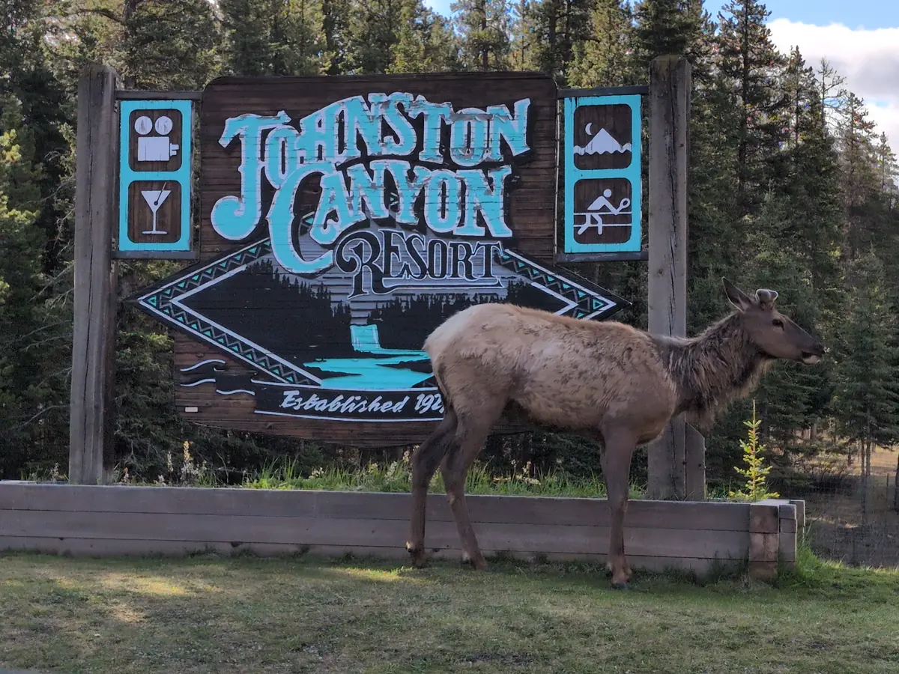
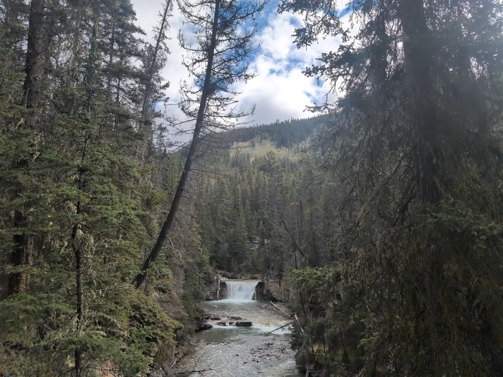
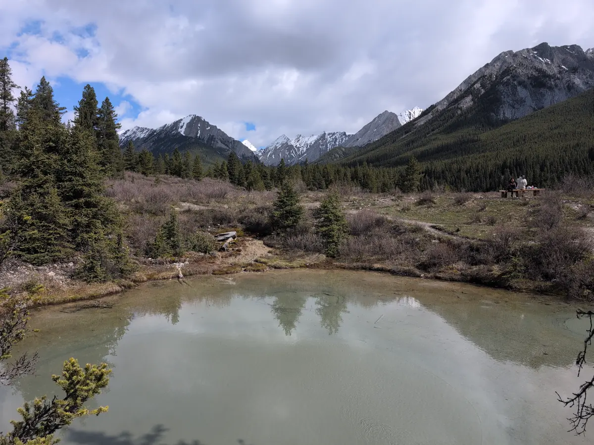

This blog post series is a direct transcript of the notes I took while visiting
Banff National Park in Alberta, Canada. I left with my sister and a friend of
ours on the 18th of May and returned on the 26th. I hope it inspires you to
travel to the Rocky Mountains and have an adventure of your own. We will
certainly be returning.

## Tuesday, May 20th

Woke up at 6:00am MDT to eat eggs and pack for a trip to [Johnston
Canyon](https://www.banfflakelouise.com/experiences/johnston-canyon). Left at 7
and arrived at 7:30am to see some elk by the Johnston Resort sign. Very
photogenic animals! The lower falls were nearly empty, which gave us ample
space for photos of the rushing water and natural cliff faces. The paved and
handrailed walkways swept low and far enough into the valley to catch sunlight
off the upper falls and expose the variety of mosses and lichens as we passed.
At 1.5km (~0.9mi) we rounded the last falls our path turned to mud and rock,
with brush reaching into the trail.

We listened carefully, but could only spot one solitary songbird perched high
on a grandfather [Lodgepole
Pine](https://treecanada.ca/resources/canadas-arboreal-emblems/lodgepole-pine/)
at the apex of the rocky mountain we stood on. Looking with our binoculars, we
guessed it was a [Townsend's
Warbler](https://www.audubon.org/field-guide/bird/townsends-warbler), as
suggested by one of the few information plaques at the base of the trail. We
then descended to the Alpine basins about 2km (~1.3mi) into the trail, at an
elevation of 1750m (~1mi). The trail turned into a multitude of streams, downed
trees, permafrost, and mud tracked with hoof and paw prints.

The [Ink Pots](https://theresearchedtraveler.com/ink-pots-hike-banff/) at the
end of our 5.7km (~3.5mi) hike were staggeringly beautiful. Seeing the origin
of the cold springs burbling up through the fine clay of many colors was
breathtaking. The water was totally pristine, filtered underground at 4 degrees
Celsius (~39 degrees Fahrenheit). We ate sandwiches on a bench, bundled up to
protect against the cold and winds.

The hike back down was much quicker, partially because I wasn't compelled to
snap photos between the increasing waves of tourists. Our shins were all tired
and stiff when we finally reached the trailhead, so some rest was in order.

We napped for around an hour at our hotel before packing our bathing suits and
driving to the [Banff Upper Springs](https://www.banfflakelouise.com/experiences/banff-upper-hot-springs) resort on Sulfur Mountain at 4:30pm. On
arrival, we had to take our shoes off and navigate the public showers and
lockers which resembled an animal's enrichment puzzle. They required a
combination of a key, a special coin, and a stranger's patient guidance to
operate. The pool outside was unexpectedly busy, chlorinated, and full of
particulate matter. 40 degrees Celsius (104 degrees Fahrenheit) water paired
with breezy 10 degrees Celsius (50 degrees Fahrenheit) air is worth it,
however.

That night we watched [Twilight: New
Moon](https://www.imdb.com/title/tt1259571/). Why does everyone in this movie
insist on escalating totally normal situations? My sister and I were cackling with
laughter because I confused the statue of [Christ The
Redeemer](https://artsandculture.google.com/story/sanctuary-of-christ-the-redeemer-congrega%C3%A7%C3%A3o-do-sant%C3%ADssimo-redentor/_wVRd1us2c-sLg?hl=en)
from Rio with the [Holy Land USA cross](https://www.holylandwaterbury.org/) from Waterbury, Connecticut.

