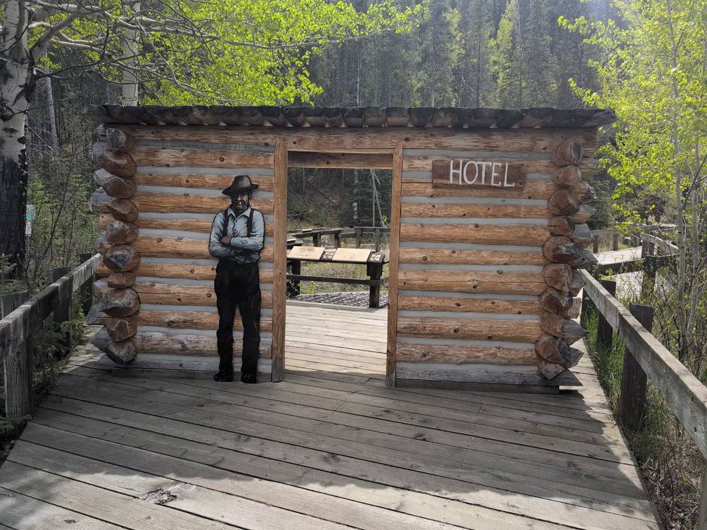
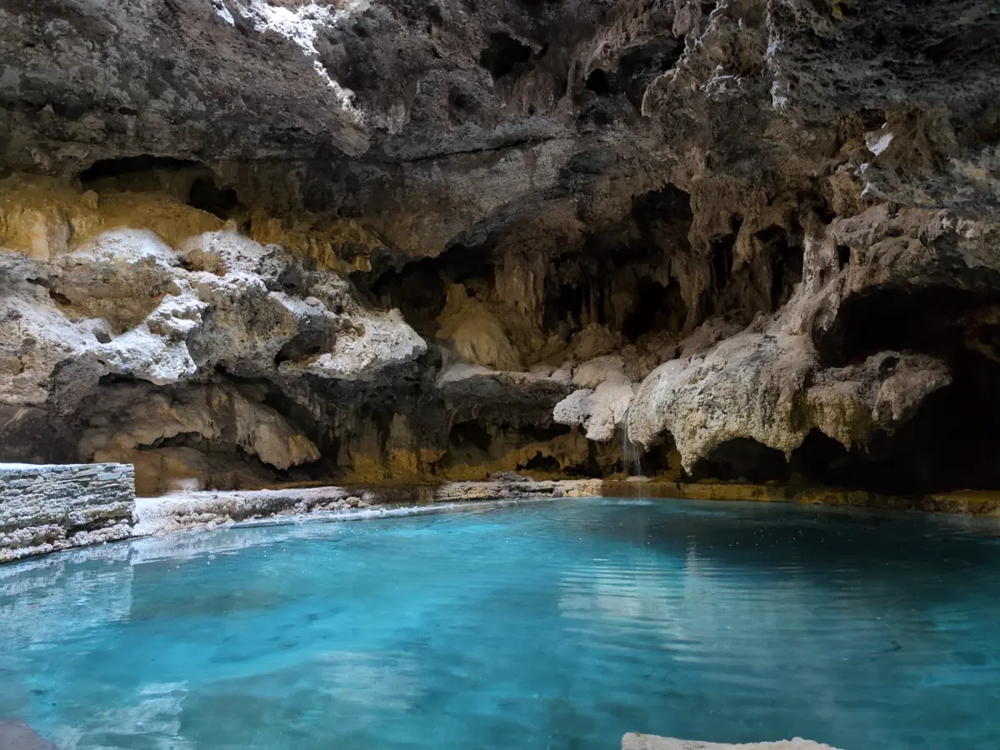
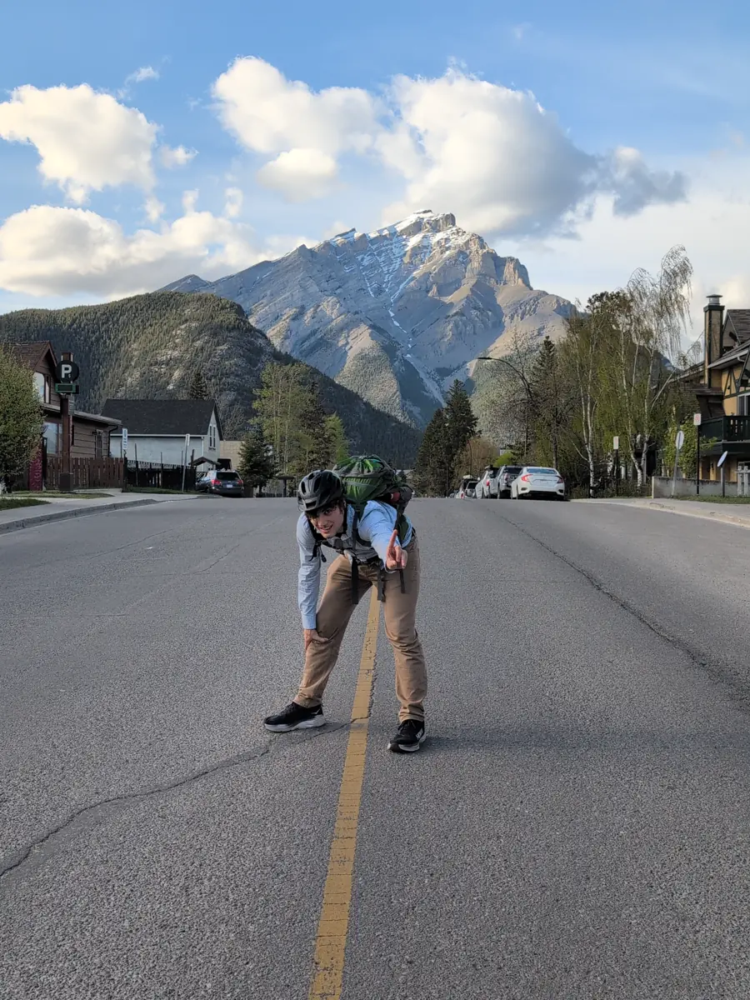

This blog post series is a direct transcript of the notes I took while visiting
Banff National Park in Alberta, Canada. I left with my sister and a friend of
ours on the 18th of May and returned on the 26th. I hope it inspires you to
travel to the Rocky Mountains and have an adventure of your own. We will
certainly be returning.

## Wednesday, May 21st

Today was a real adventure! We started at 9:00am with a trip to the [Cave and
Basin Natural Historic Site](https://parks.canada.ca/lhn-nhs/ab/caveandbasin),
located on lower [Sulfur
Mountain](https://www.banfflakelouise.com/experiences/sulphur-mountain-trail).
Our national parks pass included a free tour and nature walk with our annual
pass. Nico, our guide, was lovely. The sulfur smell was especially strong by
the manmade tunnels that redirected water from the springs and caverns uphill.
We were surprised to learn that the most biodiverse area of Banff was only
created because three prospectors (William McCardell, Tom McCardell, and Frank
McCabe) had destroyed much of the original rock deposits around the caves to
build a ["hotel"](https://parks.canada.ca/lhn-nhs/ab/caveandbasin/culture) in
1883.

The [Banff Springs
Snails](https://bowvalleynaturalists.org/natural-history/snails/) and
surrounding marshlands, with their [yellow throated
warblers](https://www.audubon.org/field-guide/bird/yellow-throated-warbler),
garter snakes, and red-winged blackbirds were a treat to behold. The indigenous
art depicting elk hunts and healing springs were also fascinating. Navigating
the tunnel to their [sacred
cave](https://parks.canada.ca/lhn-nhs/ab/caveandbasin/activ/activites-activities)
felt a bit like trespassing, but we were glad to experience it firsthand amidst
the crowd of preschoolers craning their necks at the place.

At 4pm my sister and I left for Banff to rent mountain bikes at [Banff Adventures
Co.](https://www.banffadventures.com/rentals/bikes/) and went on a proper
Hopkins Family Adventure. We first trundled up [Tunnel
Mountain](https://www.banfflakelouise.com/experiences/tunnel-mountain-summit-trail)'s
steep inclines, and got confused navigating due to the road and trail signs
seemingly disagreeing. We zig-zagged around camp sites, elk, and ground
squirrels to view the [Hoodoo
trail](https://www.banfflakelouise.com/experiences/hoodoos-trail) from afar
through binoculars. at 6:00pm we zipped down to Surprise Corner on what we
believed was a downhill bike trail. It was not. When we reached the river 4km
(~2.5mi) short, we had to walk our bikes up switchbacks and down three flights
of stairs(!) since our trail trailed off into open water. This miscalculation
was likely all our own, no maps or trail blazes or cairns to blame, in fact the
trail was almost entirely unmarked until we reached Surprise Corner and [Bow
River Falls](https://banff.ca/654/Bow-Falls-Trail) around 6:50pm. We got a
good view of the full Upper Springs resort which we had visited the evening
before. We zipped through town and returned the bikes at 7:10pm, with 20
minutes to spare before the rental place closed. Phew!

Side note, we would later learn [Tunnel Mountain was once called Sacred Buffalo
Guardian
Mountain](https://gripped.com/routes/tunnel-mountain-should-be-sacred-buffalo-guardian-mountain/)
due to its distinctive shape, but was renamed when the Canadian government
drafted a plan to blast a railway tunnel through it in 1880. The tunnel was
never built, and a proposal by indigenous people to rename the mountain has
been stuck in limbo since 2016.

I forgot to mention: we did manage to stop by the [Banff Farmer's
Market](https://banff.ca/1034/Farmers-Market) which only opens Wednesdays
9am-6pm MDT. All the stores around here seem to close at 8pm local time. Being
on the [51st parallel](https://www.google.com/search?q=banff+latitude) means
the sun sets at 9:40pm MDT, so we have plenty of time to kill in the evenings
watching Twilight movies and, in my case, writing code or blog posts like this
one. "From now on, I'm Switzerland, okay?"

