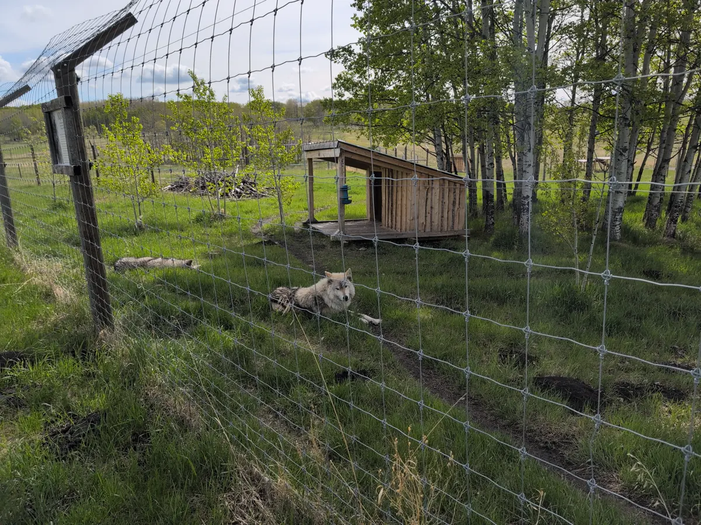
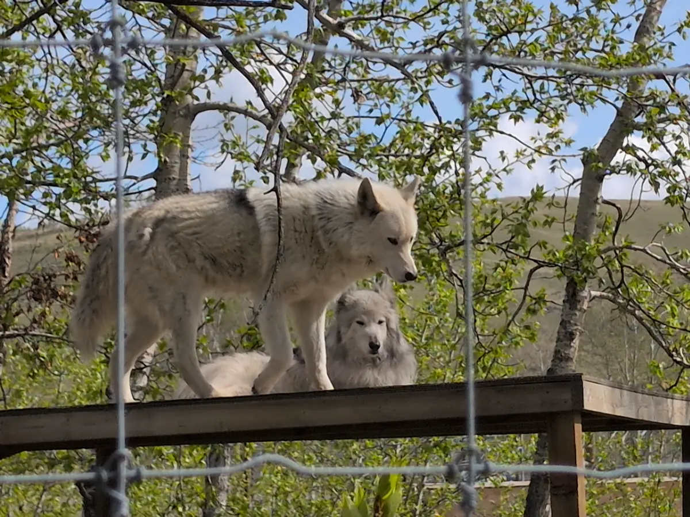

This blog post is a direct transcript of the notes I took while visiting Banff
National Park in Alberta, Canada. I left with my sister and a friend of ours on
the 18th of May and returned on the 26th. I hope it inspires you to travel to
the Rocky Mountains and have an adventure of your own. We will certainly be
returning.

## Thursday, May 22nd

Today we visited the [Yamnuska "Wolfdog"
Sanctuary](https://www.yamnuskawolfdogsanctuary.com/) in Alberta at 11am. They
rescue dog/wolf crossbreeds from neglectful owners in the exotic pets trade and
keep them in large, open pens for tourists to see. At first I worried they may
not be taken care of as well as more established zoo animals would be, but the
groundskeepers seemed to take adequate precautions to ensure the degs' confort
and health. The pens were spaceous and semi-forested, in an otherwise parren
prarie valley. The dogs would climb on large, wooden platforms and trot back
and forth in their enclosures, nap in the grass, and some even yelped for food
or begged for belly rubs when their handlers entered. The ["high wolf
content"](https://www.wolfdogawareness.com/) dogs seemed hesitant to approach
the handlers, but were intent to watch us from afar.

I forgot to mention: on the way down we stopped for what appeared to be a small
pack of dogs in a field. On further binocular-assisted inspection they were
revealed to be statues or stuffed puppets in life scale. We could not find them
on the way home. Were they moved, or did we miss them? I think I saw a Twilight
Zone episode like this once... No photos to accompany this story, sorry.

After making some delicious, lean-beef burgers, 2 cups of instant rice for my
classic (read: repetitive) meal prep of rice, corn, and beans, and another
helping of frozen vegetable mix, I was ready to conk out for about two hours. I
woke at 3:30pm and made the mistake of reheating coffee before my sister and
our friend took us out shopping in Banff. My sister and I stopped for Vietnamese
coffee, plus some touristy tchotchkes. We eventually reached [Rude
Boys](https://rudeboys.com/products/rude-boys-shop-deck-s25-banff-ave-8-5?_pos=1&_sid=1a8219e9a&_ss=r)
to look at some pricey snowboards. The season apparently ended on [Victoria
Day](https://www.statutoryholidays.com/victoria_day_comments.php), so
everything was discounted by quite a bit, but not enough to justify purchasing.

We started on [Twilight: Breaking Dawn, Part
One](https://www.imdb.com/title/tt1324999/) at 8:30pm. What an absolute
nightmare sequence of a movie. I was wired enough from the sugar and caffeine
that I decided to run down to the nearby gas station afterward to get a snack.
Of course it was closed. To my shock, all the doors to the hotel were locked on
my return! Luckily my sister was also awake, and gave me the basement garage door
combination at 1:30am MDT. Apparently someone saw me skulking around our rear
entrance and nearly called the police. I should consider myself lucky that I
didn't trip any alarms myself! Or that my sister was also haunted by Twilight's
dubious writing.

