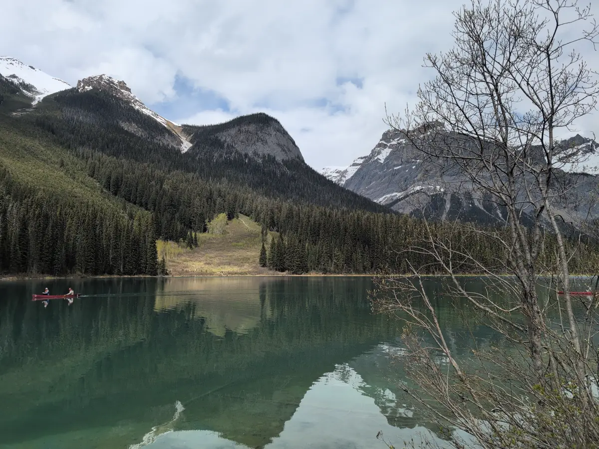
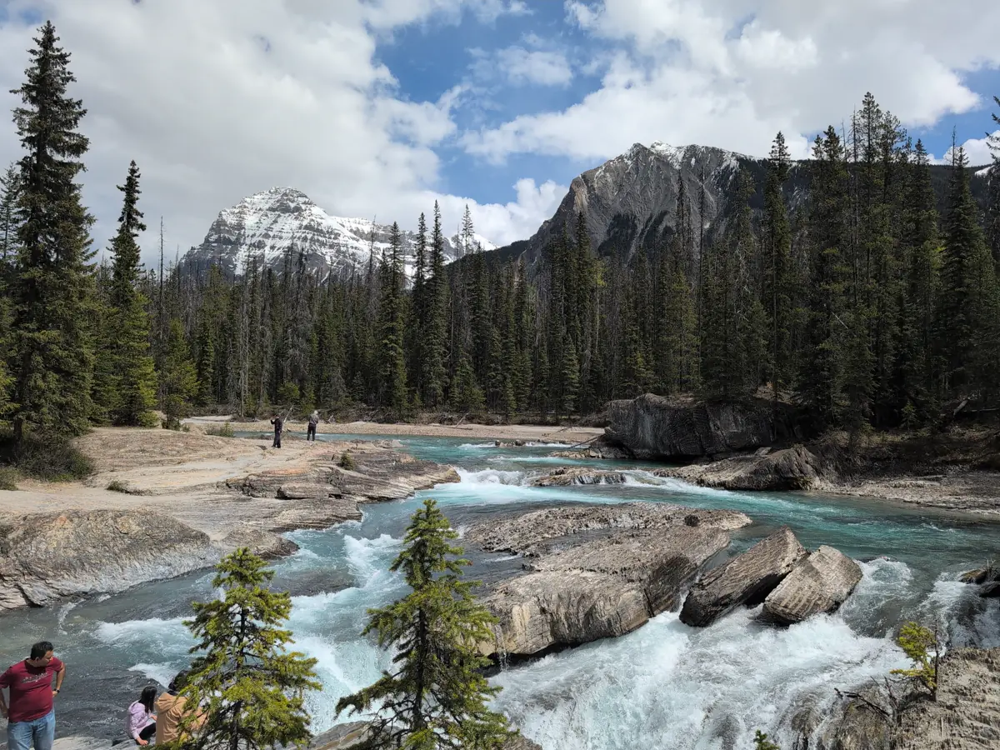
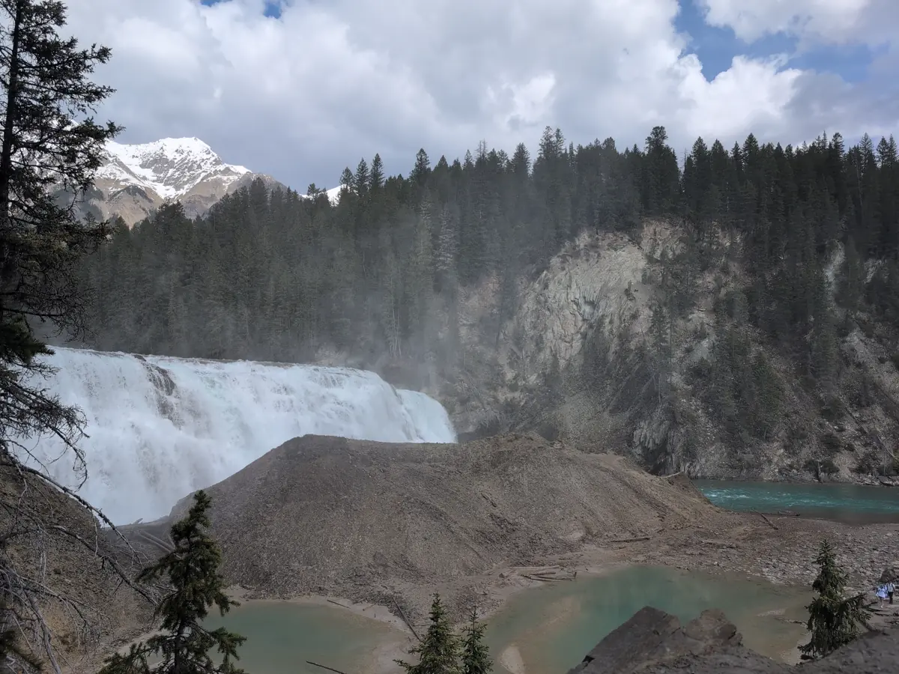

# Banff Canadian National Park Travel Log

This blog post series is a direct transcript of the notes I took while visiting
Banff National Park in Alberta, Canada. I left with my sister and a friend of
ours on the 18th of May and returned on the 26th. I hope it inspires you to
travel to the Rocky Mountains and have an adventure of your own. We will
certainly be returning.

## Friday, May 23rd

my sister and our friend woke up at 6:30pm MDT and got started cleaning up our
AirBnB. I awoke at 8:45am MDT. At 10:45am MST we checked out of the hotel with
our frozen/refrigerable foods in our reusable burlap grocery bags, wrapped in
ice and plastic. My sister drove us an hour down Route 1 to [Yoho National
Park](https://parks.canada.ca/pn-np/bc/yoho) in British Columbia, while
listening to the audiobook ["That's Not What I Meant" by Deborah
Tannen](https://www.deborahtannen.com/thats-not-what-i-meant). We did pass
signs for [Jasper](https://parks.canada.ca/pn-np/ab/jasper) and
[Kootenay](https://parks.canada.ca/pn-np/bc/kootenay), but they did not list
the hundreds of kilometers you'd need to travel to reach them. Soon we reached
Yoho's visitor center for more collectible pins, and directions to which hikes
were open in May. Most of the park was closed due to snowfall, but we were
recommended to visit [Emerald
Lake](https://www.banfflakelouise.com/experiences/emerald-lake) and [Wapta
Falls](https://parks.canada.ca/pn-np/bc/yoho/activ/randonnee-hike/courte-short#wapta),
so that's what we did. Emerald Lake was super crowded since we arrived at 1pm.
We managed to sit down for lunch at ["Cilantro on the
Lake"](https://crmr.com/resorts/emerald-lake/dining/) for a cozy and "rustic"
meal with window seats overlooking the cherry red canoe rentals bobbing in the
distant azure. My traveling companions got to try poutine on fries with gravy for
the first time! We didn't stop to canoe, but my sister and I did snag a beautiful
Emerald Lake blanket that closely resembled our father's fishing lure quilt
that we used as blanket fort material as children.

After lunch, we stopped at the ["Natural Bridge" over Kicking Horse
River](https://waterfallrecord.com/2022/05/25/natural-bridge-falls-british-columbia/),
which strongly reminded me of [Pollards
Mills](https://www.newenglandwaterfalls.com/nh-pollardsmills.html) in Newport,
New Hampshire. On our way to Wapta Falls we got stuck behind a road painting
truck for roughly thirty minutes. It was a bit irritating being caught in the
car equivalent of a fly trap... We had no trouble distinguishing the median and
shoulder on our way however. If we had lane assist enabled on our rental car we
could have snoozed all the way without trouble.

The side road to Wapta Falls seemed to immitate the surface of a golf ball. The
trail itself started out muddy, then fell away to switchbacks after 2km
(~1.2mi) or so. This gave us several neat vantage points to view Wapta Falls'
enormous throughput and resulting mists. These mists were great enough to
reflect off the clay mound ahead where, thousands of years ago, the river once
fell. We left the downstream riverbed soaked with pristine droplets, after
skipping stones and taking photos of the double-rainbows beneath the spray.

The new AirBnB we checked into was an 'in-law suite' in a neighborhood close to
Banff. We had to get creative with the smart TV to watch [Twilight: Breaking
Dawn, Part Two](https://www.imdb.com/title/tt1673434/). The movie was honestly
a boring letdown, especially compared to the first three movies. The twist at
the end came across like a slap in the face to a new Twilight fan like myself
(Go [Team
Bella](https://www.quora.com/Are-you-team-Edward-or-team-Jacob-Twilight-and-why)!!).
It is 1:00am MDT at the time of this writing. Let's see how this pull-out couch
fares!

