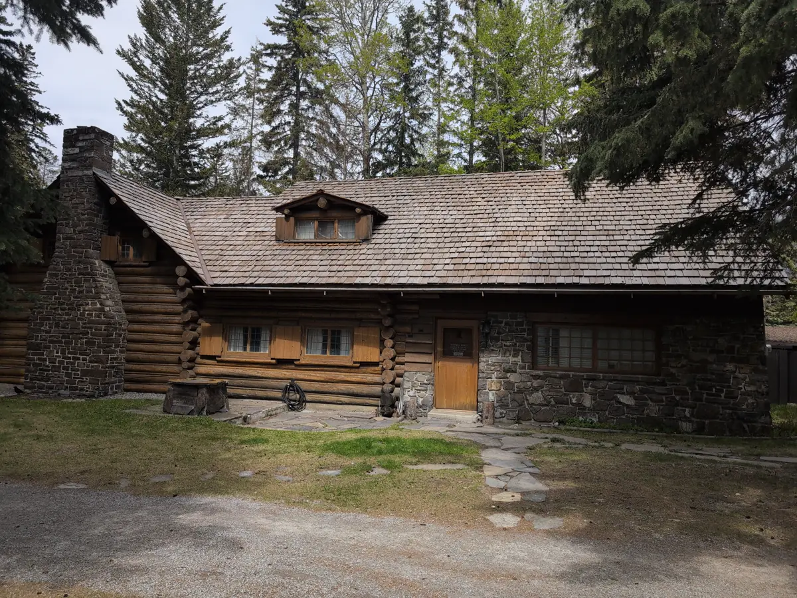
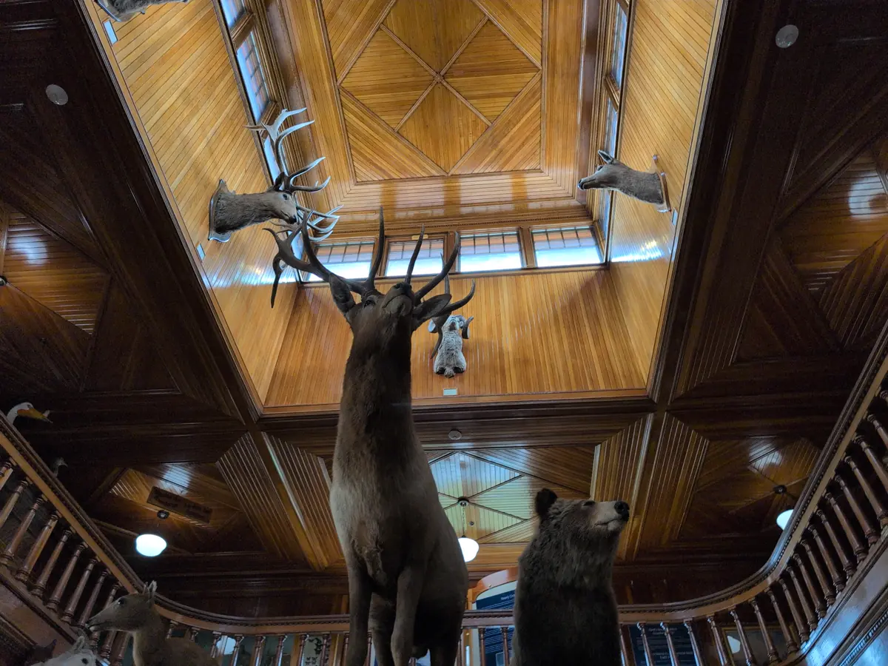

This blog post series is a direct transcript of the notes I took while visiting
Banff National Park in Alberta, Canada. I left with my sister and a friend of
ours on the 18th of May and returned on the 26th. I hope it inspires you to
travel to the Rocky Mountains and have an adventure of your own. We will
certainly be returning.

## Saturday, May 24th

Today we left at 10:30am MDT after a lovely egg sandwich breakfast by my sister
(I love you NAME REDACTED!). We [toured the Moore and Whyte family display
homes](https://www.whyte.org/tours) at 11am. We learned that their
philanthropic relationship with the Banff in the early twentieth century was
foundational to the park's identity today. I was surprised to learn that Pearl
Moore was a beading competition judge, and had many pieces of art and [beadwork
gifted to her estate by
indigenous](https://www.indigenousarchives.whyte.org/beaded-vest). Our
Australian tour guide, Peter, was quick to point out the irony of our tour
group consisting entirely of Americans and Brits, with no Canadians or
indigenous people whatsoever. The tour ended with a story about [Bill
Peyto](https://www.peyto.com/wildbill.aspx), a famous woodsman and mountain
guide, allegedly releasing a snared lynx into a hotel bar to clear out other
customers so he could have a drink in silence.

We then proceeded into the Whyte museum proper, to view the widely-advertised
[Indigenous Seven art exhibit](https://www.whyte.org/exhibitions), which had
opened a few weeks ago. It felt like the first display of indigenous culture
that was celebratory rather than dismissive or apologetic. The rest of the
museum had old recordings of railway construction, letters between early
prospectors, and a history of how Banff went from a small moutain town to a
Canadian national park. Included in the exhibits were letter from Native
Americans, [cosigned by the
UN](https://www.justice.gc.ca/eng/declaration/about-apropos.html), formally
requesting permission from the Canadian Government to travel between the
segregated reservations to hunt and worship on their own terms.

At 3:00pm MDT we rented bikes from [Banff
Adventures](https://www.banffadventures.com/rentals/bikes/) once again and
cruised down past Bow River Falls to bike the paved trails near [Fairmont's
Banff Springs Golf
Course](https://www.fairmont.com/en/hotels/banff/fairmont-banff-springs/golf.html)
that we had to skip on our first biking excursion. The paved trail made for
much easier riding than the Surprise Corner or Hoodoo trail, and we made it
around the river with no trouble. My traveling companions stopped by [The
Waldhaus](https://www.banff-springs-hotel.com/dine/waldhaus-restaurant/) to see
what was on the menu. 34 CAD$ for a burger? Maybe another day.

After returning our bikes at 6:30pm MDT, I decided to run off solo to the
[Banff Visitor Center](https://www.banfflakelouise.com/contact-us) to pick up
an English/French park pin, and nearly got lost on my way back to our parking
spot across town. I ended up [running all the way up Cougar Street between the
condos to get back](https://maps.app.goo.gl/BaNB6yDqLqhDD62g9), thinking I was
late. To my continuing luck, my friend had independently decided to get some
trinkets of their own on the way, and we all arrived at about the same time,
though I was the only one gasping for air thanks to Banff's elevation of 1,380m
(~4,530ft).

